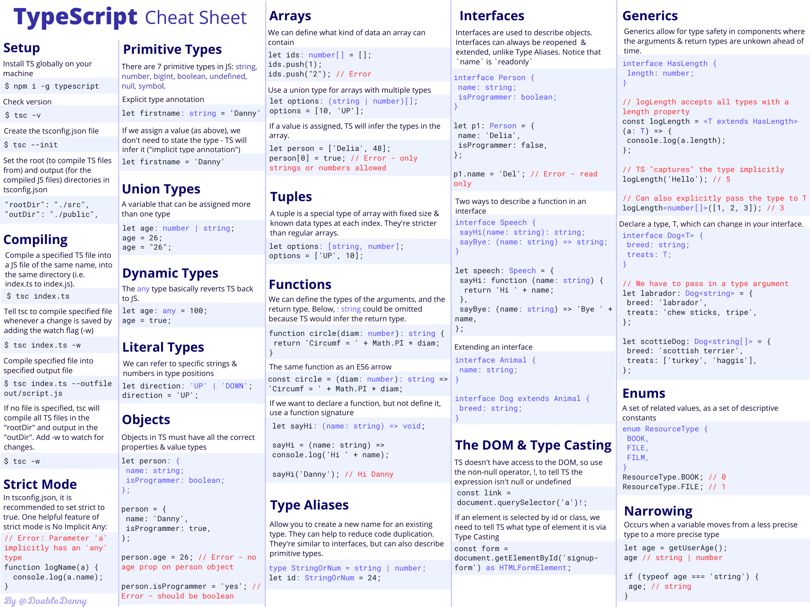

# Learn TypeScript – The Ultimate Beginners Guide
* https://tuts.heomi.net/learn-typescript-the-ultimate-beginners-guide/

# TypeScript cheat sheet PDF

This makes it easy to look up and revise concepts/syntax quickly.





# Install TypeScript Compiler

First, ensure you have [Node](https://nodejs.org/en/download/) installed globally on your machine.

You can [install NVM - Node Version Manager](https://www.freecodecamp.org/news/node-version-manager-nvm-install-guide/) which is a tool for managing Node version in your device:
* https://github.com/coreybutler/nvm-windows/releases

After NVM installed, you can use [NVM commands guide](https://gist.github.com/chranderson/b0a02781c232f170db634b40c97ff455) for operations


```bash
$ nvm list-remote
$ nvm install 20.18.0
$ nvm use 20.18.0
$ nvm list
  * 20.18.0 (Currently using 64-bit executable)
$ node -v
v20.18.0
$  npm -v
10.8.2
```

After Node installed by NVM, you can install the TypeScript compiler globally on your machine:
```bash
$ npm i -g typescript

added 1 package in 4s
npm notice
npm notice New minor version of npm available! 10.8.2 -> 10.9.0
npm notice Changelog: https://github.com/npm/cli/releases/tag/v10.9.0
npm notice To update run: npm install -g npm@10.9.0
npm notice
```

Noted that: [After npm upgrade, on Windows getting error that npm.ps1 is not digitally signed](https://github.com/npm/cli/issues/7280). Running this seems to have fixed it for me in Powershell as an admin. Ref: [about_Execution_Policies](https://learn.microsoft.com/vi-vn/powershell/module/microsoft.powershell.core/about/about_execution_policies?view=powershell-7.4)

```bash
$  Get-ExecutionPolicy -Scope CurrentUser
Undefined
$ set-ExecutionPolicy RemoteSigned -Scope CurrentUser
Get-ExecutionPolicy -Scope CurrentUser
RemoteSigned
```

To check if the installation is successful
```bash
$  tsc -v
Version 5.6.3
```


# How to Compile TypeScript

Open up your text editor and create a TypeScript file (for example, `index.ts`). Write some JavaScript or TypeScript:
```ts
let sport = 'football';

let id = 5;
```

We can now compile this down into JavaScript with the following command:
```bash
$ tsc index
```

TSC will compile the code into JavaScript and output it in a file called index.js:
```js
var sport = 'football';
var id = 5;
```

If you want TSC to compile your code automatically, whenever you make a change, add the "watch" flag:
```bash
tsc index.ts -w
```

TypeScript will reports errors in your text editor whilst you are coding:
```ts
var sport = 'football';
var id = 5;

id = '5'; // Error: Type 'string' is not assignable to 
type 'number'.
```

# How to Set Up the ts config File

The ts config file should be in the root directory of your project. In this file we can specify the root files, compiler options, and how strict we want TypeScript to be in checking our project.

First, create the ts config file:
```bash
$ tsc --init
```

You should now have a `tsconfig.json` file in the project root. Here are some options that are good to be aware of
```js
{
    "compilerOptions": {
        ...
        /* Modules */
        "target": "es2016", // Change to "ES2015" to compile to ES6
        "rootDir": "./src", // Where to compile from
        "outDir": "./public", // Where to compile to (usually the folder to be deployed to the web server)

        /* JavaScript Support */
        "allowJs": true, // Allow JavaScript files to be compiled
        "checkJs": true, // Type check JavaScript files and report errors

        /* Emit */
        "sourceMap": true, // Create source map files for emitted JavaScript files (good for debugging)
         "removeComments": true, // Don't emit comments
    },
    "include": ["src"] // Ensure only files in src are compiled
}
```

To compile everything and watch for changes:
```bash
$ tsc -w
```

Note: when input files are specified on the command line (for example, `tsc index`), `tsconfig.json` files are ignored.


# Debuging TS File with VSCode
* https://stackoverflow.com/questions/31169259/how-to-debug-typescript-files-in-visual-studio-code

First you need to install:
```bash
npm i ts-node
```

Then create `launch.json` for NodeJs type like (full in case, but you can grab only this one configurations from):
```json
{
    "version": "0.2.0",
    "configurations": [
        {
            "name": "Launch TS",
            "type": "node",
            "request": "launch",
            "runtimeArgs": [
                "-r",
                "ts-node/register"
            ],
            "args": [
                "${workspaceFolder}/${fileBasename}"
            ]
        }
    ]
}
```

Open the TS file and set breakpoint, you can start the debuging for that file.


# How to run TypeScript files from command line
* https://stackoverflow.com/questions/33535879/how-to-run-typescript-files-from-command-line

You can leave `tsc` running in watch mode using `tsc -w -p` . and it will generate `.js` files for you in a live fashion, so you can run node `foo.js` like normal

```bash
tsc src/index.ts
node dist/index.js
```

There is ts-node : https://github.com/TypeStrong/ts-node that will compile the code on the fly and run it through node 🌹

```bash
npx ts-node src/foo.ts
```

# Format Code in VSCode

* Format Document (Ctrl+Shift+I) 
* Format the entire active file. Format Selection (Ctrl+K Ctrl+F) - Format the selected text.
* On Windows Shift + Alt + F

# Primitive types in TypeScript

In JavaScript, a primitive value is data that is not an object and has no methods. There are 7 primitive data types: string, number, bigint, boolean, undefined, null, symbol.  Primitives are immutable: they can't be altered. Example:

```js
let name = 'Danny';
name.toLowerCase();
console.log(name); // Danny - the string method didn't mutate the string

let arr = [1, 3, 5, 7];
arr.pop();
console.log(arr); // [1, 3, 5] - the array method mutated the array

name = 'Anna' // Assignment gives the primitive a new (not a mutated) value
```

In JavaScript, all primitive values (apart from null and undefined) have object equivalents that wrap around the primitive values. These wrapper objects are String, Number, BigInt, Boolean, and Symbol

Back to TypeScript, we can set the type we want a variable to be be adding `: type` (called a "type annotation" or a "type signature") after declaring a variable. Examples:

```ts
let id: number = 5;
let firstname: string = 'danny';
let hasDog: boolean = true;

let unit: number; // Declare variable without assigning a value
unit = 5;
```

But it's usually best to not explicitly state the type, as TypeScript automatically infers the type of a variable (type inference):
```ts
let id = 5; // TS knows it's a number
let firstname = 'danny'; // TS knows it's a string
let hasDog = true; // TS knows it's a boolean

hasDog = 'yes'; // ERROR
```

A union type is a variable that can be assigned more than one type:
```ts
let age: string | number;
age = 26;
age = '26';
```

# Reference Types

In JavaScript, almost “everything” is an object. In fact (and confusingly), strings, numbers and booleans can be objects if defined with the `new` keyword:

```js
let firstname = new String('Danny');
console.log(firstname); // String {'Danny'}
```

But when we talk of reference types in JavaScript, we are referring to arrays, objects and functions.

```ts
let point1 = { x: 1, y: 1 };
let point2 = point1;

point1.y = 100;
console.log(point2.y); // 100 (point1 and point2 refer to the same memory address where the point object is stored)
```

# Arrays in TypeScript

In TypeScript, you can define what type of data an array can contain:
```ts
let ids: number[] = [1, 2, 3, 4, 5]; // can only contain numbers
let names: string[] = ['Danny', 'Anna', 'Bazza']; // can only contain strings
let options: boolean[] = [true, false, false]; can only contain true or false
let books: object[] = [
  { name: 'Fooled by randomness', author: 'Nassim Taleb' },
  { name: 'Sapiens', author: 'Yuval Noah Harari' },
]; // can only contain objects
let arr: any[] = ['hello', 1, true]; // any basically reverts TypeScript back into JavaScript

ids.push(6);
ids.push('7'); // ERROR: Argument of type 'string' is not assignable to parameter of type 'number'.
```

You can use union types to define arrays containing multiple types:
```ts
let person: (string | number | boolean)[] = ['Danny', 1, true];
person[0] = 100;
person[1] = {name: 'Danny'} // Error - person array can't contain objects
```

# Objects in TypeScript

Objects in TypeScript must have all the correct properties and value types:

```ts
// Declare a variable called person with a specific object type annotation
let person: {
  name: string;
  location: string;
  isProgrammer: boolean;
};

// Assign person to an object with all the necessary properties and value types
person = {
  name: 'Danny',
  location: 'UK',
  isProgrammer: true,
};

person.isProgrammer = 'Yes'; // ERROR: should be a boolean


person = {
  name: 'John',
  location: 'US',
}; 
// ERROR: missing the isProgrammer property
```


When defining the signature of an object, you will usually use an `interface`.
```ts
interface Person {
  name: string;
  location: string;
  isProgrammer: boolean;
}

let person1: Person = {
  name: 'Danny',
  location: 'UK',
  isProgrammer: true,
};

let person2: Person = {
  name: 'Sarah',
  location: 'Germany',
  isProgrammer: false,
};
```

We can also declare function properties with function signatures. We can do this using old-school common JavaScript functions (`sayHi`), or ES6 arrow functions (`sayBye`):
```ts
interface Speech {
  sayHi(name: string): string;
  sayBye: (name: string) => string;
}

let sayStuff: Speech = {
  sayHi: function (name: string) {
    return `Hi ${name}`;
  },
  sayBye: (name: string) => `Bye ${name}`,
};

console.log(sayStuff.sayHi('Heisenberg')); // Hi Heisenberg
console.log(sayStuff.sayBye('Heisenberg')); // Bye Heisenberg
```

Note that in the `sayStuff` object, `sayHi` or `sayBye` could be given an arrow function or a common JavaScript function – TypeScript doesn’t care.


# Functions in TypeScript

We can define what the types the function arguments should be, as well as the return type of the function:
```ts
// Define a function called circle that takes a diam variable of type number, and returns a string
function circle(diam: number): string {
  return 'The circumference is ' + Math.PI * diam;
}

console.log(circle(10)); // The circumference is 31.41592653589793
```

The same function, but with an ES6 arrow function:
```ts
const circle = (diam: number): string => {
  return 'The circumference is ' + Math.PI * diam;
};

console.log(circle(10)); // The circumference is 31.41592653589793
```

Notice how it isn’t necessary to explicitly state that `circle` is a function; TypeScript infers it. TypeScript also infers the return type of the function, so it doesn’t need to be stated either. Although, if the function is large, some developers like to explicitly state the return type for clarity.

```ts
// Using explicit typing 
const circle: Function = (diam: number): string => {
  return 'The circumference is ' + Math.PI * diam;
};

// Inferred typing - TypeScript sees that circle is a function that always returns a string, so no need to explicitly state it
const circle = (diam: number) => {
  return 'The circumference is ' + Math.PI * diam;
};
```

We can add a question mark after a parameter to make it optional. Also notice below how c is a union type that can be a `number` or `string`:

```ts
const add = (a: number, b: number, c?: number | string) => {
  console.log(c);

  return a + b;
};

console.log(add(5, 4, 'I could pass a number, string, or nothing here!'));
// I could pass a number, string, or nothing here!
// 9
```

A function that returns nothing is said to return `void` – a complete lack of any value. Below, the return type of void has been explicitly stated. But again, this isn’t necessary as TypeScript will infer it.

```ts
const logMessage = (msg: string): void => {
  console.log('This is the message: ' + msg);
};

logMessage('TypeScript is superb'); // This is the message: TypeScript is superb
```

If we want to declare a function variable, but not define it (say exactly what it does), then use a function signature. Below, the function `sayHello` must follow the signature after the colon:
```ts
// Declare the varible sayHello, and give it a function signature that takes a string and returns nothing.
let sayHello: (name: string) => void;

// Define the function, satisfying its signature
sayHello = (name) => {
  console.log('Hello ' + name);
};

sayHello('Danny'); // Hello Danny
```

# Dynamic (any) types

Using the `any` type, we can basically revert TypeScript back into JavaScript:

```ts
let age: any = '100';
age = 100;
age = {
  years: 100,
  months: 2,
};
```

It’s recommended to avoid using the `any` type as much as you can, as it prevents TypeScript from doing its job – and can lead to bugs.


# Type Aliases

Type Aliases can reduce code duplication, keeping our code DRY. Below, we can see that the `PersonObject` type alias has prevented repetition, and acts as a single source of truth for what data a person object should contain.

```ts
type StringOrNumber = string | number;

type PersonObject = {
  name: string;
  id: StringOrNumber;
};

const person1: PersonObject = {
  name: 'John',
  id: 1,
};

const person2: PersonObject = {
  name: 'Delia',
  id: 2,
};

const sayHello = (person: PersonObject) => {
  return 'Hi ' + person.name;
};

const sayGoodbye = (person: PersonObject) => {
  return 'Seeya ' + person.name;
};
```

# The DOM and type casting

TypeScript doesn’t have access to the DOM like JavaScript. This means that whenever we try to access DOM elements, TypeScript is never sure that they actually exist.

The below example shows the problem:
```ts
const link = document.querySelector('a');

console.log(link.href); // ERROR: Object is possibly 'null'. TypeScript can't be sure the anchor tag exists, as it can't access the DOM
```

With the non-null assertion operator (`!`) we can tell the compiler explicitly that an expression has value other than null or undefined. This is can be useful when the compiler cannot infer the type with certainty, but we have more information than the compiler.

```ts
// Here we are telling TypeScript that we are certain that this anchor tag exists
const link = document.querySelector('a')!;

console.log(link.href); // www.freeCodeCamp.org
```

Notice how we didn't have to state the type of the link variable. This is because TypeScript can clearly see (via Type Inference) that it is of type `HTMLAnchorElement`.

But what if we needed to select a DOM element by its class or id? TypeScript can't infer the type, as it could be anything.

```ts
const form = document.getElementById('signup-form');

console.log(form.method);
// ERROR: Object is possibly 'null'.
// ERROR: Property 'method' does not exist on type 'HTMLElement'.
```

Above, we get two errors. We need to tell TypeScript that we are certain form exists, and that we know it is of type HTMLFormElement. We do this with type casting:

```ts
const form = document.getElementById('signup-form') as HTMLFormElement;

console.log(form.method); // post
```

TypeScript also has an Event object built in. So, if we add a submit event listener to our form, TypeScript will give us an error if we call any methods that aren’t part of the Event object. Check out how cool TypeScript is – it can tell us when we’ve made a spelling mistake:

```ts
const form = document.getElementById('signup-form') as HTMLFormElement;

form.addEventListener('submit', (e: Event) => {
  e.preventDefault(); // prevents the page from refreshing

  console.log(e.tarrget); // ERROR: Property 'tarrget' does not exist on type 'Event'. Did you mean 'target'?
});
```

# Classes in TypeScript

We can define the types that each piece of data should be in a class:
```ts
class Person {
  name: string;
  isCool: boolean;
  pets: number;

  constructor(n: string, c: boolean, p: number) {
    this.name = n;
    this.isCool = c;
    this.pets = p;
  }

  sayHello() {
    return `Hi, my name is ${this.name} and I have ${this.pets} pets`;
  }
}

const person1 = new Person('Danny', false, 1);
const person2 = new Person('Sarah', 'yes', 6); // ERROR: Argument of type 'string' is not assignable to parameter of type 'boolean'.

console.log(person1.sayHello()); // Hi, my name is Danny and I have 1 pets
```

We could then create a `people` array that only includes objects constructed from the `Person` class:
```ts
let People: Person[] = [person1, person2];
```

We can add access modifiers to the properties of a class. TypeScript also provides a new access modifier called `readonly`.
```ts
class Person {
  readonly name: string; // This property is immutable - it can only be read
  private isCool: boolean; // Can only access or modify from methods within this class
  protected email: string; // Can access or modify from this class and subclasses
  public pets: number; // Can access or modify from anywhere - including outside the class

  constructor(n: string, c: boolean, e: string, p: number) {
    this.name = n;
    this.isCool = c;
    this.email = e;
    this.pets = p;
  }

  sayMyName() {
    console.log(`Your not Heisenberg, you're ${this.name}`);
  }
}

const person1 = new Person('Danny', false, 'dan@e.com', 1);
console.log(person1.name); // Fine
person1.name = 'James'; // Error: read only
console.log(person1.isCool); // Error: private property - only accessible within Person class
console.log(person1.email); // Error: protected property - only accessible within Person class and its subclasses
console.log(person1.pets); // Public property - so no problem
```

We can make our code more concise by constructing class properties this way:

```ts
class Person {
  constructor(
    readonly name: string,
    private isCool: boolean,
    protected email: string,
    public pets: number
  ) {}

  sayMyName() {
    console.log(`Your not Heisenberg, you're ${this.name}`);
  }
}

const person1 = new Person('Danny', false, 'dan@e.com', 1);
console.log(person1.name); // Danny
```

Writing it the above way, the properties are automatically assigned in the constructor – saving us from having to write them all out.

Note that if we omit the access modifier, by default the property will be `public`.

Classes can also be extended, just like in regular JavaScript:

```ts
class Programmer extends Person {
  programmingLanguages: string[];

  constructor(
    name: string,
    isCool: boolean,
    email: string,
    pets: number,
    pL: string[]
  ) {
    // The super call must supply all parameters for base (Person) class, as the constructor is not inherited.
    super(name, isCool, email, pets);
    this.programmingLanguages = pL;
  }
}
```

# Modules in TypeScript

In JavaScript, a module is just a file containing related code. Functionality can be imported and exported between modules, keeping the code well organized.

TypeScript also supports modules. The TypeScript files will compile down into multiple JavaScript files.

In the `tsconfig.json` file, change the following options to support modern importing and exporting:
```json
 "target": "es2016",
 "module": "es2015"
```

(Although, for Node projects you very likely want `"module": "CommonJS"` – Node doesn’t yet support modern importing/exporting.)

Now, in your HTML file, change the script import to be of type module:
```html
<script type="module" src="/public/script.js"></script>
```

We can now import and export files using ES6:
```ts
// src/hello.ts
export function sayHi() {
  console.log('Hello there!');
}

// src/script.ts
import { sayHi } from './hello.js';

sayHi(); // Hello there!
```

Note: always import as a JavaScript file, even in TypeScript files.

# Interfaces in TypeScript

Interfaces define how an object should look:
```ts
interface Person {
  name: string;
  age: number;
}

function sayHi(person: Person) {
  console.log(`Hi ${person.name}`);
}

sayHi({
  name: 'John',
  age: 48,
}); // Hi John
```

Interfaces are very similar to type aliases, and in many cases you can use either. The key distinction is that type aliases cannot be reopened to add new properties, vs an interface which is always extendable.

Extending an interface:
```ts
interface Animal {
  name: string
}

interface Bear extends Animal {
  honey: boolean
}

const bear: Bear = {
  name: "Winnie",
  honey: true,
}
```

Extending a type via intersections:
```ts
type Animal = {
  name: string
}

type Bear = Animal & {
  honey: boolean
}

const bear: Bear = {
  name: "Winnie",
  honey: true,
}
```

Adding new fields to an existing interface:
```ts
interface Animal {
  name: string
}

// Re-opening the Animal interface to add a new field
interface Animal {
  tail: boolean
}

const dog: Animal = {
  name: "Bruce",
  tail: true,
}
```

Here’s the key difference: a type cannot be changed after being created:
```ts
type Animal = {
  name: string
}

type Animal = {
  tail: boolean
}
// ERROR: Duplicate identifier 'Animal'.
```

As a rule of thumb, the TypeScript docs recommend using interfaces to define objects, until you need to use the features of a type.

Interfaces can also define function signatures:
```ts
interface Person {
  name: string
  age: number
  speak(sentence: string): void
}

const person1: Person = {
  name: "John",
  age: 48,
  speak: sentence => console.log(sentence),
}
```

# Interfaces with classes

We can tell a class that it must contain certain properties and methods by implementing an interface:
```ts
interface HasFormatter {
  format(): string;
}

class Person implements HasFormatter {
  constructor(public username: string, protected password: string) {}

  format() {
    return this.username.toLocaleLowerCase();
  }
}

// Must be objects that implement the HasFormatter interface
let person1: HasFormatter;
let person2: HasFormatter;

person1 = new Person('Danny', 'password123');
person2 = new Person('Jane', 'TypeScripter1990');

console.log(person1.format()); // danny
```

Ensure that `people` is an array of objects that implement `HasFormatter` (ensures that each person has the format method):
```ts
let people: HasFormatter[] = [];
people.push(person1);
people.push(person2);
```