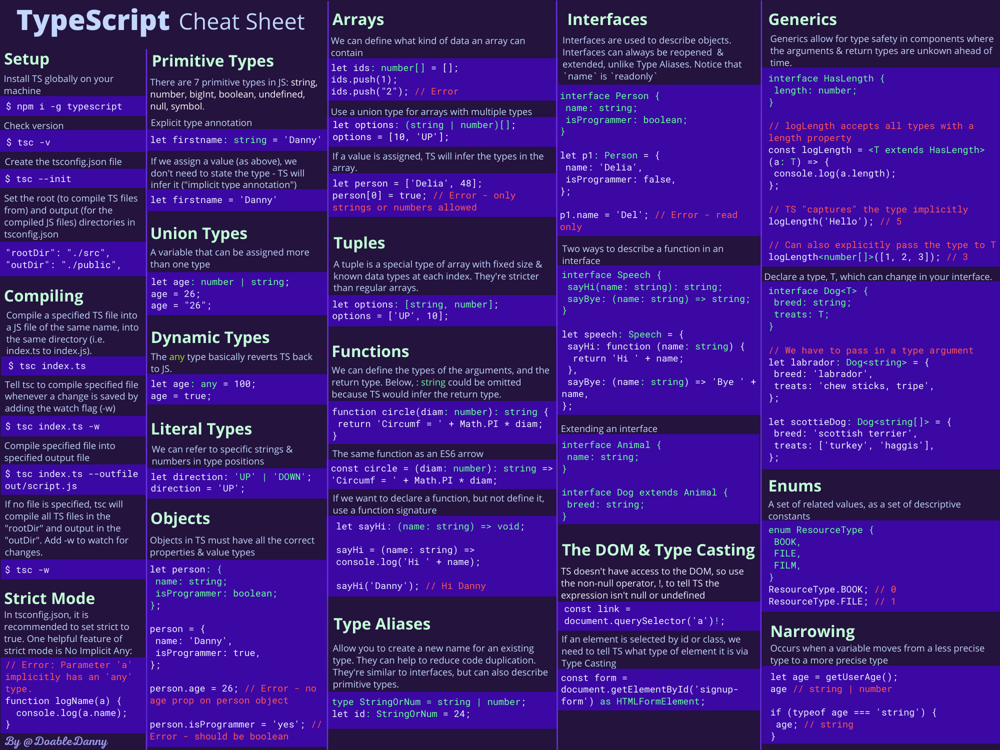

# Learn TypeScript – The Ultimate Beginners Guide
* https://tuts.heomi.net/learn-typescript-the-ultimate-beginners-guide/

# TypeScript cheat sheet PDF

This makes it easy to look up and revise concepts/syntax quickly.




# Install TypeScript Compiler

First, ensure you have [Node](https://nodejs.org/en/download/) installed globally on your machine.

You can [install NVM - Node Version Manager](https://www.freecodecamp.org/news/node-version-manager-nvm-install-guide/) which is a tool for managing Node version in your device:
* https://github.com/coreybutler/nvm-windows/releases

After NVM installed, you can use [NVM commands guide](https://gist.github.com/chranderson/b0a02781c232f170db634b40c97ff455) for operations


```bash
$ nvm list-remote
$ nvm install 20.18.0
$ nvm use 20.18.0
$ nvm list
  * 20.18.0 (Currently using 64-bit executable)
$ node -v
v20.18.0
$  npm -v
10.8.2
```

After Node installed by NVM, you can install the TypeScript compiler globally on your machine:
```bash
$ npm i -g typescript

added 1 package in 4s
npm notice
npm notice New minor version of npm available! 10.8.2 -> 10.9.0
npm notice Changelog: https://github.com/npm/cli/releases/tag/v10.9.0
npm notice To update run: npm install -g npm@10.9.0
npm notice
```

Noted that: [After npm upgrade, on Windows getting error that npm.ps1 is not digitally signed](https://github.com/npm/cli/issues/7280). Running this seems to have fixed it for me in Powershell as an admin. Ref: [about_Execution_Policies](https://learn.microsoft.com/vi-vn/powershell/module/microsoft.powershell.core/about/about_execution_policies?view=powershell-7.4)

```bash
$  Get-ExecutionPolicy -Scope CurrentUser
Undefined
$ set-ExecutionPolicy RemoteSigned -Scope CurrentUser
Get-ExecutionPolicy -Scope CurrentUser
RemoteSigned
```

To check if the installation is successful
```bash
$  tsc -v
Version 5.6.3
```


# How to Compile TypeScript

Open up your text editor and create a TypeScript file (for example, `index.ts`). Write some JavaScript or TypeScript:
```ts
let sport = 'football';

let id = 5;
```

We can now compile this down into JavaScript with the following command:
```bash
$ tsc index
```

TSC will compile the code into JavaScript and output it in a file called index.js:
```js
var sport = 'football';
var id = 5;
```

If you want TSC to compile your code automatically, whenever you make a change, add the "watch" flag:
```bash
tsc index.ts -w
```

TypeScript will reports errors in your text editor whilst you are coding:
```ts
var sport = 'football';
var id = 5;

id = '5'; // Error: Type 'string' is not assignable to 
type 'number'.
```

# How to Set Up the ts config File

The ts config file should be in the root directory of your project. In this file we can specify the root files, compiler options, and how strict we want TypeScript to be in checking our project.

First, create the ts config file:
```bash
$ tsc --init
```

You should now have a `tsconfig.json` file in the project root. Here are some options that are good to be aware of
```js
{
    "compilerOptions": {
        ...
        /* Modules */
        "target": "es2016", // Change to "ES2015" to compile to ES6
        "rootDir": "./src", // Where to compile from
        "outDir": "./public", // Where to compile to (usually the folder to be deployed to the web server)

        /* JavaScript Support */
        "allowJs": true, // Allow JavaScript files to be compiled
        "checkJs": true, // Type check JavaScript files and report errors

        /* Emit */
        "sourceMap": true, // Create source map files for emitted JavaScript files (good for debugging)
         "removeComments": true, // Don't emit comments
    },
    "include": ["src"] // Ensure only files in src are compiled
}
```

To compile everything and watch for changes:
```bash
$ tsc -w
```

Note: when input files are specified on the command line (for example, `tsc index`), `tsconfig.json` files are ignored.


# Debuging TS File with VSCode
* https://stackoverflow.com/questions/31169259/how-to-debug-typescript-files-in-visual-studio-code

First you need to install:
```bash
npm i ts-node
```

Then create `launch.json` for NodeJs type like (full in case, but you can grab only this one configurations from):
```json
{
    "version": "0.2.0",
    "configurations": [
        {
            "name": "Launch TS",
            "type": "node",
            "request": "launch",
            "runtimeArgs": [
                "-r",
                "ts-node/register"
            ],
            "args": [
                "${workspaceFolder}/${fileBasename}"
            ]
        }
    ]
}
```

Open the TS file and set breakpoint, you can start the debuging for that file.

# Format Code in VSCode

* Format Document (Ctrl+Shift+I) 
* Format the entire active file. Format Selection (Ctrl+K Ctrl+F) - Format the selected text.
* On Windows Shift + Alt + F

# Primitive types in TypeScript

In JavaScript, a primitive value is data that is not an object and has no methods. There are 7 primitive data types: string, number, bigint, boolean, undefined, null, symbol.  Primitives are immutable: they can't be altered. Example:

```js
let name = 'Danny';
name.toLowerCase();
console.log(name); // Danny - the string method didn't mutate the string

let arr = [1, 3, 5, 7];
arr.pop();
console.log(arr); // [1, 3, 5] - the array method mutated the array

name = 'Anna' // Assignment gives the primitive a new (not a mutated) value
```

In JavaScript, all primitive values (apart from null and undefined) have object equivalents that wrap around the primitive values. These wrapper objects are String, Number, BigInt, Boolean, and Symbol

Back to TypeScript, we can set the type we want a variable to be be adding `: type` (called a "type annotation" or a "type signature") after declaring a variable. Examples:

```ts
let id: number = 5;
let firstname: string = 'danny';
let hasDog: boolean = true;

let unit: number; // Declare variable without assigning a value
unit = 5;
```

But it's usually best to not explicitly state the type, as TypeScript automatically infers the type of a variable (type inference):
```ts
let id = 5; // TS knows it's a number
let firstname = 'danny'; // TS knows it's a string
let hasDog = true; // TS knows it's a boolean

hasDog = 'yes'; // ERROR
```

A union type is a variable that can be assigned more than one type:
```ts
let age: string | number;
age = 26;
age = '26';
```

# Arrays in TypeScript

In TypeScript, you can define what type of data an array can contain:
```ts
let ids: number[] = [1, 2, 3, 4, 5]; // can only contain numbers
let names: string[] = ['Danny', 'Anna', 'Bazza']; // can only contain strings
let options: boolean[] = [true, false, false]; can only contain true or false
let books: object[] = [
  { name: 'Fooled by randomness', author: 'Nassim Taleb' },
  { name: 'Sapiens', author: 'Yuval Noah Harari' },
]; // can only contain objects
let arr: any[] = ['hello', 1, true]; // any basically reverts TypeScript back into JavaScript

ids.push(6);
ids.push('7'); // ERROR: Argument of type 'string' is not assignable to parameter of type 'number'.
```

You can use union types to define arrays containing multiple types:
```ts
let person: (string | number | boolean)[] = ['Danny', 1, true];
person[0] = 100;
person[1] = {name: 'Danny'} // Error - person array can't contain objects
```

# Objects in TypeScript

Objects in TypeScript must have all the correct properties and value types:

```ts
// Declare a variable called person with a specific object type annotation
let person: {
  name: string;
  location: string;
  isProgrammer: boolean;
};

// Assign person to an object with all the necessary properties and value types
person = {
  name: 'Danny',
  location: 'UK',
  isProgrammer: true,
};

person.isProgrammer = 'Yes'; // ERROR: should be a boolean


person = {
  name: 'John',
  location: 'US',
}; 
// ERROR: missing the isProgrammer property
```


When defining the signature of an object, you will usually use an interface.
```ts
nterface Person {
  name: string;
  location: string;
  isProgrammer: boolean;
}

let person1: Person = {
  name: 'Danny',
  location: 'UK',
  isProgrammer: true,
};

let person2: Person = {
  name: 'Sarah',
  location: 'Germany',
  isProgrammer: false,
};
```

We can also declare function properties with function signatures.
```ts
interface Speech {
  sayHi(name: string): string;
  sayBye: (name: string) => string;
}

let sayStuff: Speech = {
  sayHi: function (name: string) {
    return `Hi ${name}`;
  },
  sayBye: (name: string) => `Bye ${name}`,
};

console.log(sayStuff.sayHi('Heisenberg')); // Hi Heisenberg
console.log(sayStuff.sayBye('Heisenberg')); // Bye Heisenberg
```


# Functions in TypeScript
We can define what the types the function arguments should be, as well as the return type of the function: